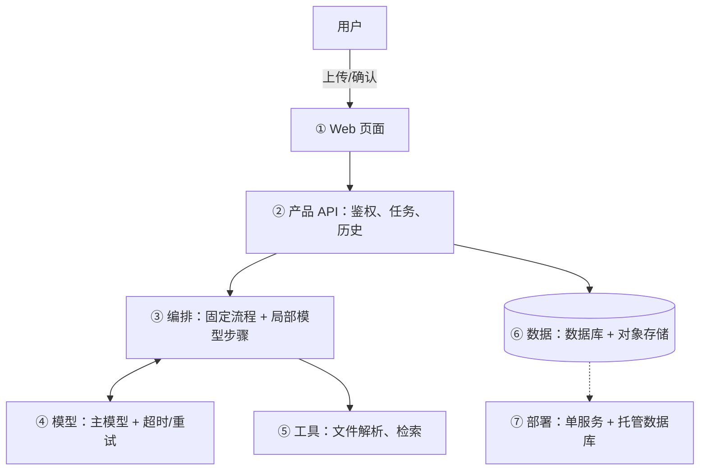

# 七层架构视角

用于检查职责是否遗漏，不是要求每个产品都画满七层。小工具可以合并层级，或在某层写“不适用”。

| 层 | 名称 | 回答的问题 | 落地锚点 |
| --- | --- | --- | --- |
| ① | 交互层 | 谁在用、怎么用？ | CLI / Web / App / API / 语音；同步或异步；人机比 |
| ② | 产品层 | 产品外壳是什么？ | 账户、会话、请求路由、业务规则、计费 |
| ③ | Agent 编排层 | Harness 如何运转？ | 循环、工具分发、hooks、权限、记忆、任务、技能、压缩、子 Agent、目标闭环 |
| ④ | 模型层 | 智能从哪来？ | 主模型、视觉/评估等辅助模型、路由、fallback、成本 |
| ⑤ | 能力集成层 | 如何触达外部世界？ | 内部工具、MCP server、知识库、第三方 API |
| ⑥ | 数据层 | 什么需要持久化？ | 业务数据、任务状态、文件产物、记忆、轨迹、日志指标 |
| ⑦ | 基础设施层 | 如何部署运行？ | 单进程 / 服务 / 函数、沙箱、队列、调度、监控 |

两条横切关注点贯穿各层，不单独成层：

- **安全边界**：①鉴权、②数据隔离、③工具审批、⑤外部服务凭据与范围、⑥数据保留与删除。
- **可观测性**：③④⑤⑥⑦的日志、指标、轨迹采集点；日志脱敏。

## 画法

用 Mermaid `flowchart`，只画真实存在的模块。每条边说明：传什么数据、以谁的权限、失败在哪里处理。

图下附一段“贯穿各层的数据流”：从用户一次操作开始，依次经过哪些层，到结果被保存和再次查看为止。
